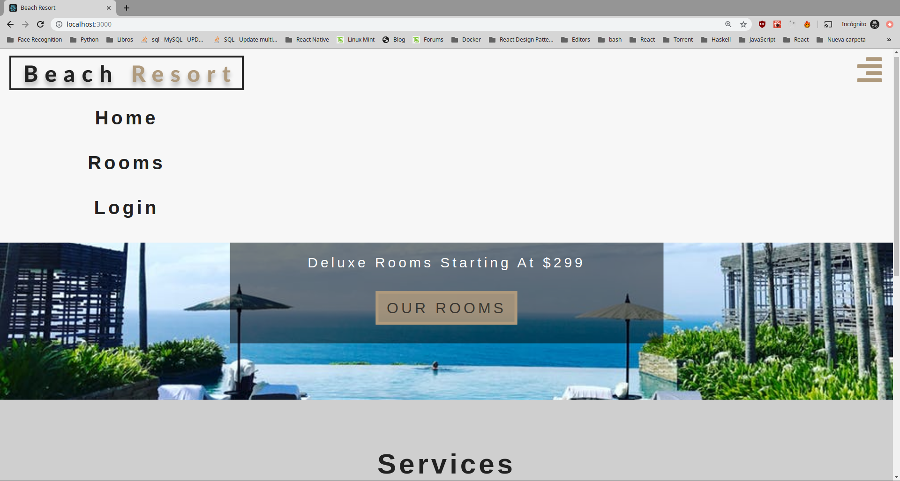
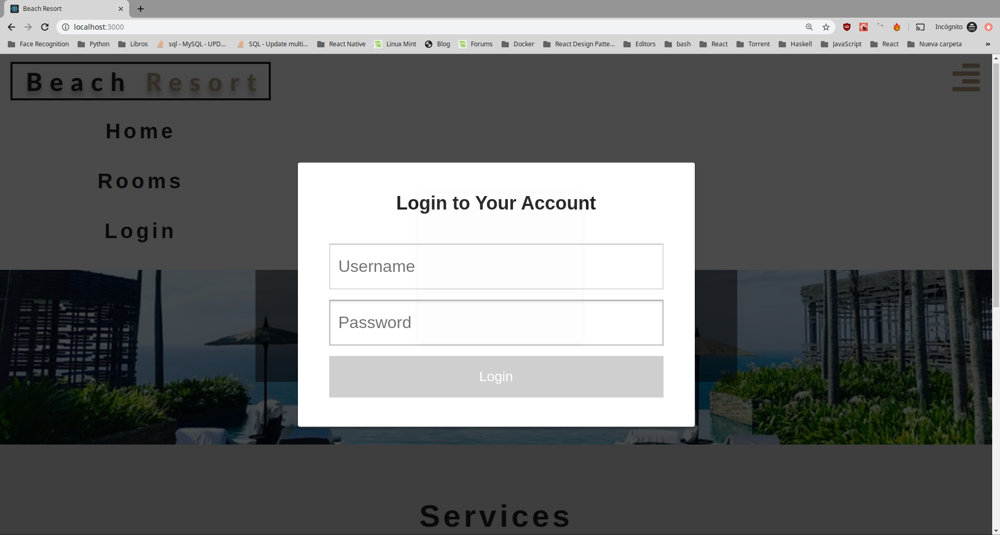

# Examen Primera Evaluación

# Día 22/11/2019 Tiempo: 5 horas

- Nota: Cada pregunta se valorará como bien o como mal (valoraciones intermedias serán excepcionales).
- Nota2: En cada pregunta se especifica si se valora en el examen de diseño o en el de desarrollo o en ambos.
- Nota3: Para aprobar cada examen hay que obtener una puntuación mínima de 5 puntos en ese examen.
- Nota4: Organice su tiempo. Si no consigue resolver un apartado pase al siguiente. El examen consta de apartados de diseño y de desarrollo que por lo general se pueden resolver por separado. Si un apartado depende de otro que no sabe resolver, siempre puede dar una solución que aunque no sea correcta, le permita seguir avanzando.
- Nota5: Para que una solución sea correcta, no sólo hay que conseguir que haga lo que se pide, sino que además todo lo que funcionaba lo tiene que seguir haciendo.
- Nota6: Lea completamente el examen antes de empezar y comience por lo que le parezca más fácil.

Pasos previos antes de empezar

- Clone el repositorio del enunciado

```bash
git clone https://github.com/surtich/enunciado-examen.git
```

- Vaya al directorio del proyecto

```bash
cd enunciado-examen
```

- Configure su usuario de git:

```bash
git config user.name "Sustituya por su nombre y apellidos"
git config user.email "Sustituya por su correo electrónico"
```

- Cree un _branch_ con su nombre y apellidos separados con guiones (no incluya mayúsculas, acentos o caracteres no alfabéticos, excepción hecha de los guiones). Ejemplo:

```bash
    git checkout -b <fulanito-perez-gomez>
```

- Compruebe que está en la rama correcta:

```bash
    git status
```

- Suba la rama al repositorio remoto:

```bash
    git push origin <nombre-de-la-rama-dado-anteriormente>
```

- Instale las dependencias y arranque la aplicación:

```bash
    yarn install
    yarn start
```

Navegue a [http://localhost:3000](http://localhost:3000)

- Dígale al profesor que ya ha terminado para que compruebe que todo es correcto y desconecte la red.

## EXAMEN

El único ejercicio pretende simular la acción de `login`.


#### 1.- Login.

#### 1.1.- (1 punto diseño) Añada una opción más al menú que permita hacer login.

Nota: El estilo debe ser exactamente el de las otras opciones de menú.



#### 1.2.- Al pulsar sobre la opción de login se mostrará un formulario modal.

Nota: Un formulario modal es un formulario que no permite interactuar con la página hasta que no se haya rellenado la información.



#### 1.2-1.- (1,5 puntos diseño) Por hacer el componente modal.

- Nota: Al pulsar sobre login, se pondrá un `div` semitransparente que impedirá interactuar con la página.
- Nota 2: Esto se puede conseguir colocando un contenedor con posición `fixed` en la esquina superior izquierda y que ocupe toda la página.

#### 1.2-2.- (1,5 puntos diseño) Por mostrar el formulario centrado en la página.

#### 1.2-3.- (2 puntos diseño) El formulario tendrá exactamente el estilo que se muestra.

#### 1.2-4.- (1 punto diseño) Se producirá un efecto de `fadein` al mostrar el login.

#### 1.2-5.- (1 punto diseño) Al ponerse encima de los campos `username` y `password` el borde superior se resaltará y al hacer foco en ellos se resaltarán todos los bordes.

#### 1.2-6.- (1 punto desarrollo) El botón de login estará deshabilitado cuando `username` o/y `password` estén vacíos y habilitado cuando ambos tengan al menos un carácter no vacío.

#### 1.2-7.- (1 punto diseño) Cuando el botón de login esté habilitado, tendrá el estilo mostrado. Al situarse encima, se desplazará ligeramente de forma animada.

#### 1.2-8.- (1 punto desarrollo) Al pulsar sobre el botón de login, se ocultará el formulario.

#### 1.2-9.- (1 punto desarrollo) También se ocultará el formulario si se pulsa con el ratón sobre la zona semitransparente.

#### 1.2-10.- (1 punto desarrollo) También se ocultará el formulario si se pulsa la tecla `esc` estando el foco sobre cualquier componente.

Nota: Para esto puede ser útil capturar el evento `keydown` del objeto `window`.

#### 1.2-11.- (1 punto desarrollo, 1 punto diseño) Al ocultar el formulario de login, se hará con un efecto `fadeout`.

#### 1.2-12.- (1 punto desarrollo) Tras ocultar el formulario de login, al volverlo a mostrar los campos `username` y `password` estarán vacíos.

Nota: Este apartado sólo se valorará si se ha resuelto correctamente el apartado 1.2.6

#### 1.2-13.- (2 puntos desarrollo) Si se pulsa el botón login con los valores `pepe` cómo `username` y `12345` como `password`, en vez de la opción de menú `login` se mostrará la opción `logout`. En caso de pulsar sobre el botón `login` con cualquiera otros valores, simplemente se ocultará el formulario sin mostrar ningún mensaje.

#### 1.2-14.- (1 punto desarrollo) Al pulsar sobre `logout` se ocultará esa opción y se mostrará nuevamente `login`.

#### 1.2-15.- (1 punto desarrollo) Añada un test que pruebe los dos apartados anteriores.

## Para entregar

- Ejecute el siguiente comando para comprobar que está en la rama correcta y ver los ficheros que ha cambiado:

```bash
    git status
```

- Prepare los cambios para que se añadan al repositorio local:

```bash
    git add .
    git commit -m "completed exam"
```

- Compruebe que no tiene más cambios que incluir:

```bash
    git status
```

- Dígale al profesor que va a entregar el examen.

- Conecte la red y ejecute el siguiente comando:

```bash
    git push origin <nombre-de-la-rama>
```

- Abandone el aula en silencio.
